# Game Name: Kids' World of Fun

## Installation Process:
- Download the game dw3.zip file. 
- Unzip it in the 'www' folder inside the 'wamp64' folder in your local disk. The file path should be:  
  `C:\wamp64\www`
- Go to your browser and enter the following path:  
  `http://localhost/dw3/index.php`
- On the homepage, click 'Sign up' at the header and proceed to create a new account. Once the account has been successfully created, you can log in and start the game. Feel free to explore the website.

## Developers
1. **Developer: Huynh Tu Anh Chau**
   - Creation of user accounts or registration (Sign-Up) using AJAX to check real-time validation.
   - Real-time validation of information entered by the user in the user account creation form with AJAX.
   - Login to an existing user account (Sign-In) using AJAX for real-time input checking.
   - Disconnect from a connected user account (Sign-Out and Time-Out).
   - Creation of the structure to create and exchange data with the database.
   - Changing the password of an existing user account using AJAX for real-time validation.
   - Creation of the structure of web pages to display (e.g., head, header, nav, footer).
   - Display of the history of the results of all game rounds, fetching data from MySQL.

2. **Contributions by Other Team Members:**
   - Management of several levels of a question/answer game which follow one another.
   - Abandoning a game in progress.
   - Customized display of features and additional interactivity.
   - Creation and implementation of the GitHub account.
   - Creation of folder and file structures.
   - Coordination of integration of different functionalities.

## Game's Release Date:
April 12, 2024

## Features of the Website:
- **User Account Management:** Registration, login, logout, and password reset with AJAX real-time validation.
- **Real-time Form Validation:** AJAX for instant feedback in registration, login, and password reset forms.
- **Multi-Level Game:** Six levels of increasing difficulty.
- **Game History:** Fetches data from MySQL and displays user history.
- **Database Interaction:** MySQL for storing/retrieving user and game data.

## How the Game Works:
Players start with 6 lives. Wrong answers reduce lives, and they must complete all 6 levels. If lives run out, the game is marked as 'gameover'. A win or incomplete status is saved based on the outcome. Game levels:
- **Level 1:** Arrange 6 letters in ascending order.
- **Level 2:** Arrange 6 letters in descending order.
- **Level 3:** Arrange 6 numbers in ascending order.
- **Level 4:** Arrange 6 numbers in descending order.
- **Level 5:** Enter the smallest and largest letter in a set.
- **Level 6:** Enter the smallest and largest number in a set.

## Technical Information:
- **Programming Language:** PHP 8.2.13
- **Database Management System:** MySQL 8.2.0
- **Other:** AJAX, JavaScript, HTML, CSS

## Screenshot Illustration (Stored in the 'project_images' folder):

1. **About_Screen.jpg**  
   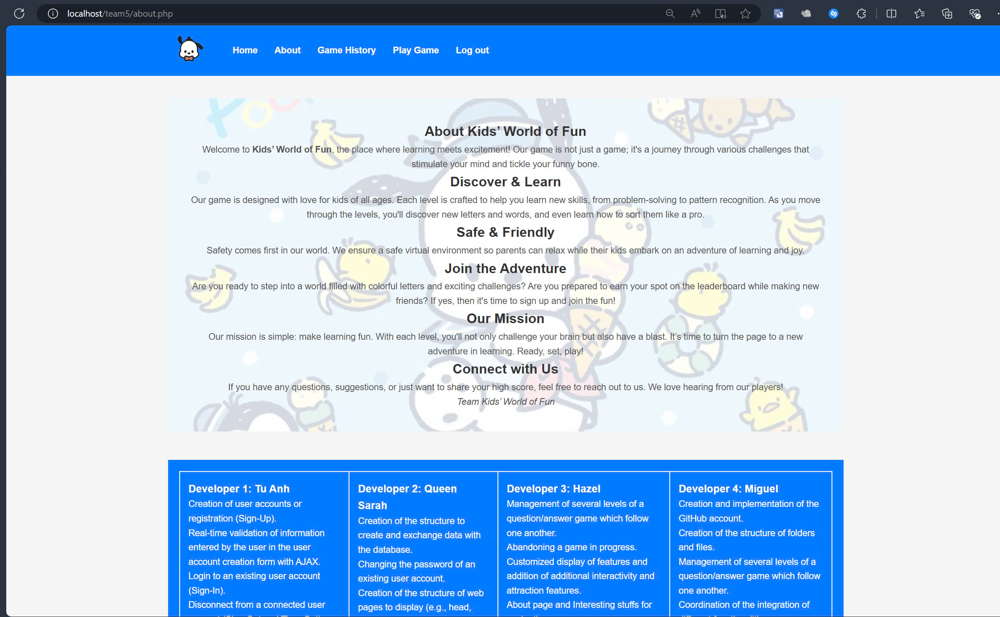  
   Displays the 'About' page of the game.

2. **After_Succeed_Reset.jpg**  
   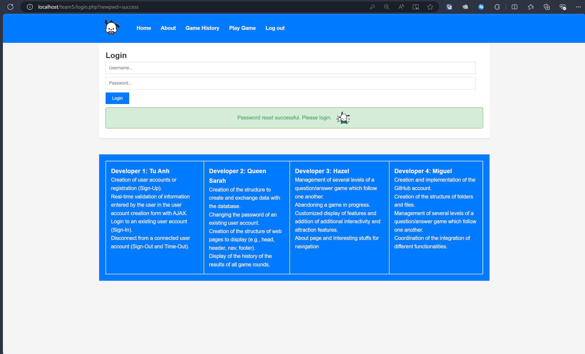  
   Message showing successful password reset.

3. **Gaming_History.jpg**  
   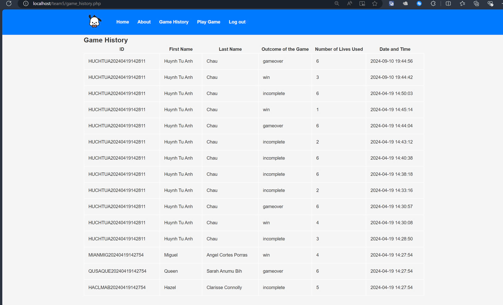  
   Shows the game history of all users, fetching data from MySQL.

4. **Home_Screen.jpg**  
   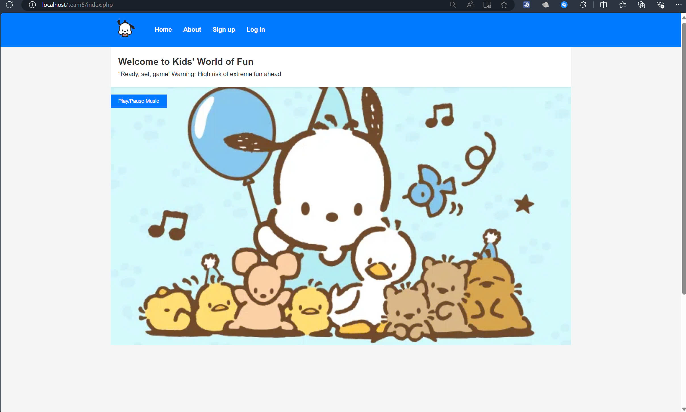  
   The home screen with the welcome message and game mascot.

5. **Login_Screen.jpg**  
   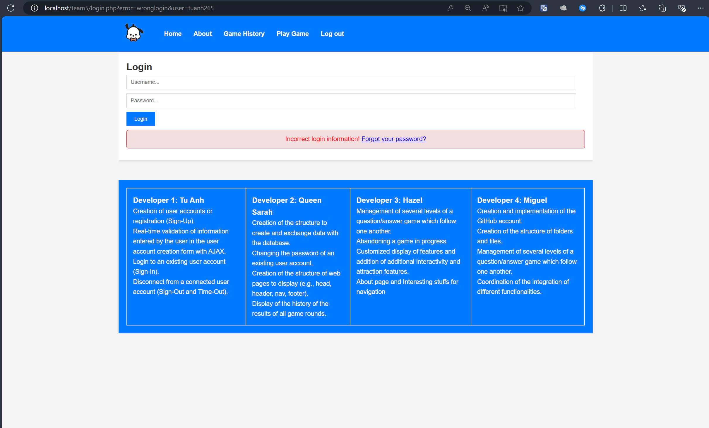  
   The login screen, which uses AJAX for real-time validation.

6. **Lost_The_Game.jpg**  
   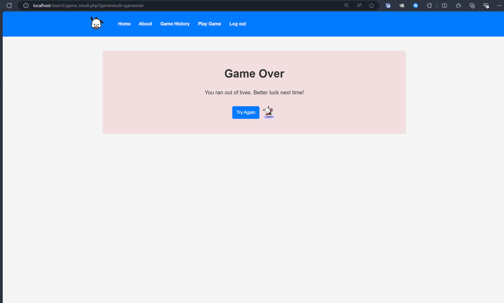  
   Message indicating the player has lost the game.

7. **Msg_Go_To_Next_Round.jpg**  
   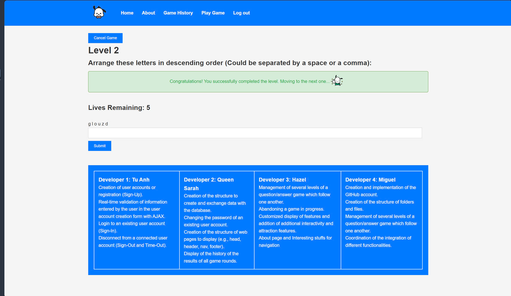  
   Notification of completing a level and moving to the next.

8. **Msg_Wrong_Answer.jpg**  
   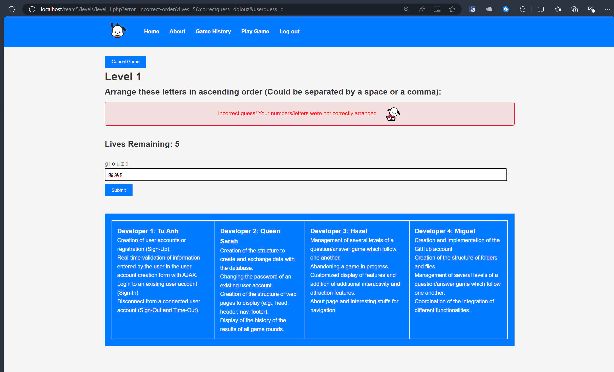  
   Message showing a wrong answer during gameplay.

9. **Reset_Password_Screen.jpg**  
   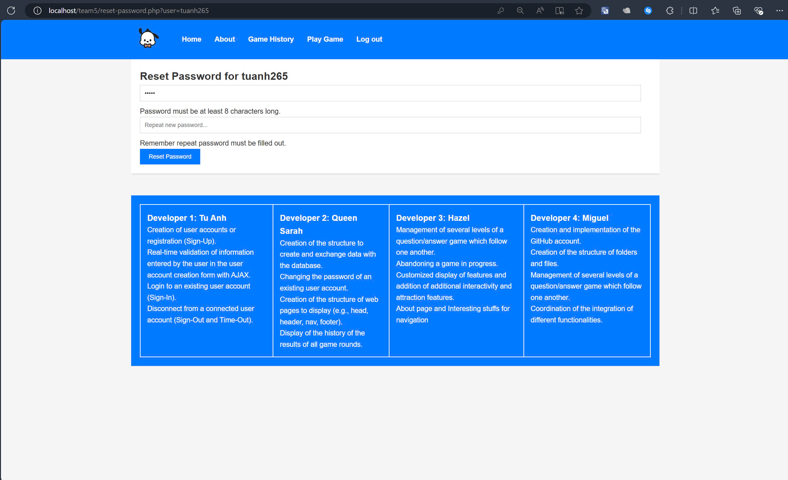  
   The interface for resetting the password, using AJAX for real-time validation.

10. **Reset_Password_Screen(2).jpg**  
     
   Another view of the password reset screen, using AJAX.

11. **Sign_Up_Screen.jpg**  
   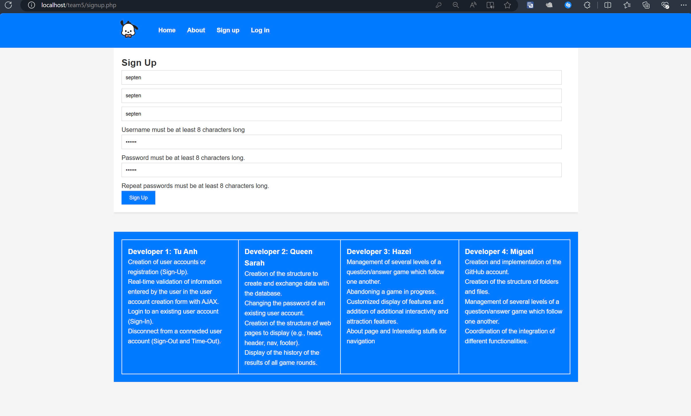  
   The sign-up page, using AJAX for real-time input checking.

12. **Won_The_Game_Screen.jpg**  
   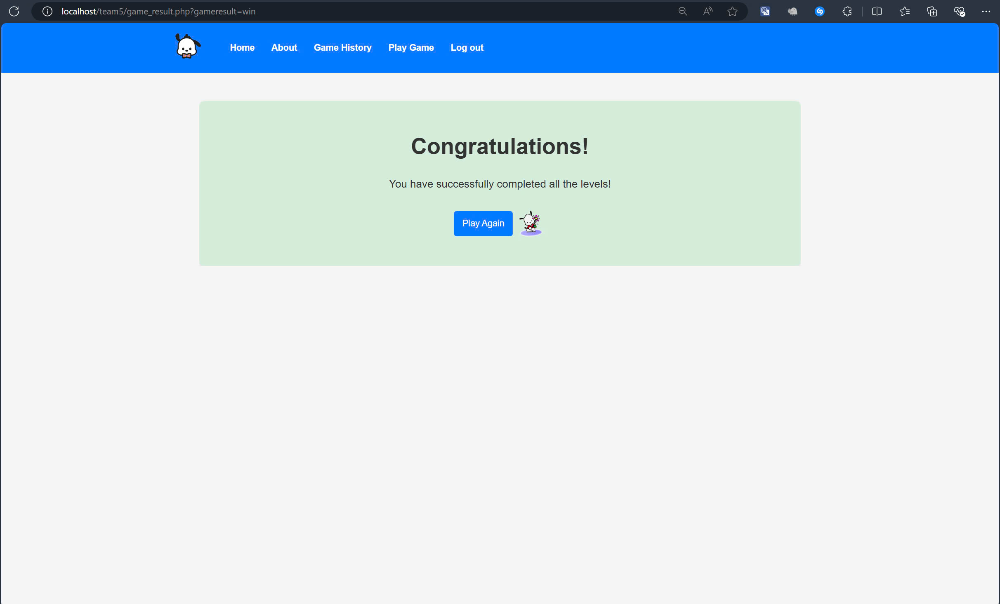  
   Message indicating the player has won the game.

